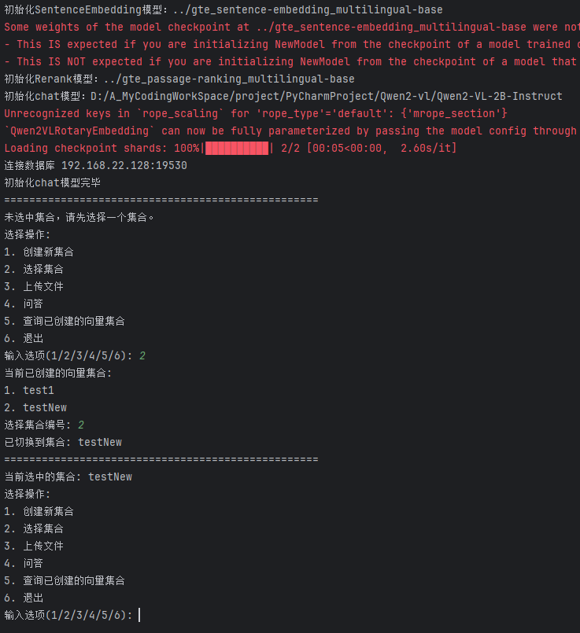
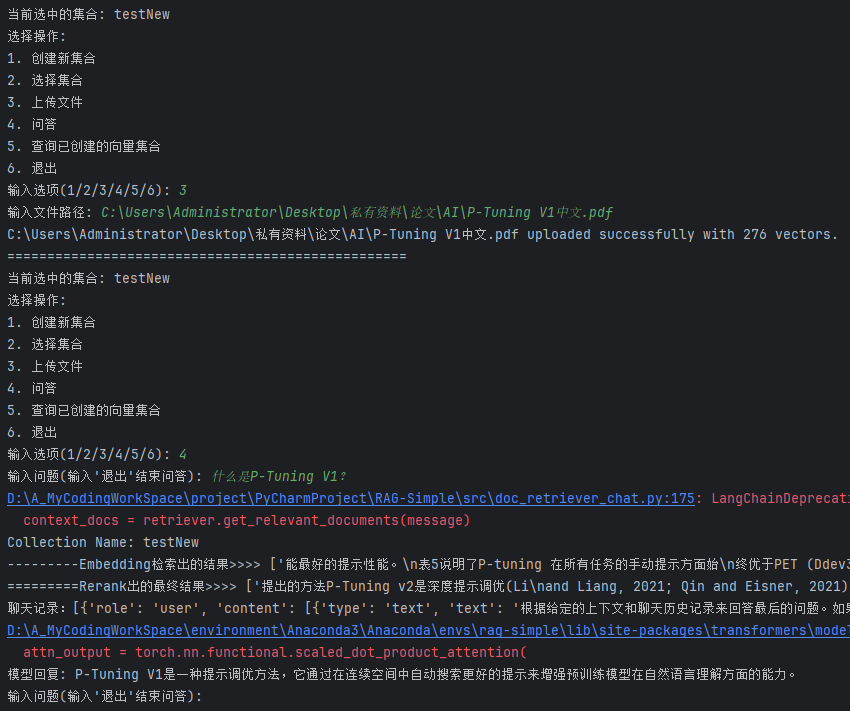

# RAG-Simple

先来谈谈我的想法：

本项目旨在让你能以比较简单的方式跑起一个真正的RAG项目，整个项目下来我认为最困难的应该是安装向量数据库`Milvus`了，不过按照我的步骤来你应该能度过难关。本项目主要面向小白、没接触过RAG的人、用过RAG API但是想自己搭建一套本地项目又不知道怎么办的人、用过或想用QAnything但是又没GPU服务器的人等等，大神也可以来看看怎么拷打改进一下。

尽管没什么人会看到，但我还是想说，我觉得目前很多开源项目都很高级，缺少相对较简单的实现，例如QAnything这么庞大的RAG项目我一个没什么基础的人要怎么入手？我按照README能跑起来了但是我不知道他到底想干嘛啊？所以我觉得应该要有人提供简单实现，先上手了后续怎么改进随你心情，这个项目的源码也是很简单，就算你0基础倒也不需要细节到每一行都看懂，基本能看明白想干嘛就OK了我觉得。


## 步骤

### 0.前情提要

本项目需要用到一台Linux的服务器或虚拟机（如果你有，请跳过第0点），为了安装向量数据库，如果你的Windows电脑可以虚拟化然后成功用上了docker就当我没说，否则Windows本地直接使用`Milvus`特别麻烦，刚开始试了由于Windows版的`Milvus`没人维护更新了好像，导致跟部分依赖不兼容，因此最后我选择老实用Linux。我服务器和虚拟机都试过了，服务器是最方便的，虚拟机你已经有了的话也方便，没有的话请先去百度一下“VMWare安装Centos7”。


### 1.安装向量数据库`Milvus`

1. 从GitHub wget `dockercompose.yml`文件

   ```
   wget https://github.com/milvus-io/milvus/releases/download/v2.4.4/milvus-standalone-docker-compose.yml -O docker-compose.yml
   ```

2. 启动dockercompose开启一键下载，需要下载`quay.io/coreos/etcd`、`minio/minio`、`milvusdb/milvus`三个镜像

   这步的前提是你安装了docker-compose，如果你没安装，请见下面的【1】

   ```
   docker-compose up -d
   docker ps
   ```

3. 一般会在安装第三个milvusdb/milvus的时候卡住，如果没卡就更好了，卡了的话就把docker源换成下面的源：

   ```
   sudo vim /etc/docker/daemon.json
   ```

   替换为：

   ```
   {
           "registry-mirrors": [
             "https://ox288s4f.mirror.aliyuncs.com",
             "https://registry.docker-cn.com",
             "http://hub-mirror.c.163.com",
             "https://mirror.ccs.tencentyun.com"
           ]
   }
   ```

   重启一下docker：

   ```
   sudo systemctl daemon-reload
   sudo systemctl restart docker
   ```

   然后再次：

   ```
   docker-compose up -d
   docker ps
   ```

   不要保留原来的源，因为你不知道他到底走了哪一条，如果出现失败的情况就重试几次，反正这几个源我试了一次云服务器一次本地虚拟机都成功了，虽然不知道他到底走的哪条。

4. 好了之后开放一下防火墙19530端口

   ```
   firewall-cmd --zone=public --add-port=19530/tcp --permanent   # 开放19530端口
   ```

   ```
   firewall-cmd --reload   # 配置立即生效
   ```

   ```
   firewall-cmd --zone=public --list-ports	# 查看防火墙所有开放的端口
   ```

   如果是云服务器还要去开一下控制台里的安全组哦。


【1】安装docker-compose

如果你不确定安装哪个版本的compose，那么请在这里对照一下你的docker版本，如果你懒得看，那就随便下一个低版本的docker-compose
https://docs.docker.com/compose/compose-file/compose-versioning/

下载：（我这是1.25.1版本）

```
sudo curl -L https://github.com/docker/compose/releases/download/1.25.1/docker-compose-`uname -s`-`uname -m` -o /usr/local/bin/docker-compose
```

授权：

```
sudo chmod +x /usr/local/bin/docker-compose
```

最后检查一下版本看看是否安装成功：

```
[root@iZ7xvdsewbsbkltg2ic1z3Z ~]# docker-compose --version
docker-compose version 1.25.1, build a82fef07
```


### 2.安装torch

```
pip install torch==2.2.1+cu118 --index-url https://download.pytorch.org/whl/cu118
```


### 3.安装本项目的依赖项

```
pip install -r requirements.txt -i http://mirrors.aliyun.com/pypi/simple -i https://pypi.tuna.tsinghua.edu.cn/simple some-package
```


安装Transfomers

```
pip install git+https://github.com/huggingface/transformers -i http://mirrors.aliyun.com/pypi/simple -i https://pypi.tuna.tsinghua.edu.cn/simple some-package
```


### 4.下载iic/gte_passage-ranking_multilingual-base模型

```
git clone https://www.modelscope.cn/iic/gte_passage-ranking_multilingual-base.git
```

放到根目录下的gte_passage-ranking_multilingual-base文件夹内


### 5.下载iic/gte_sentence-embedding_multilingual-base模型

```
git clone https://www.modelscope.cn/iic/gte_sentence-embedding_multilingual-base.git
```

放到根目录下的`gte_sentence-embedding_multilingual-base`文件夹内


### 6.下载QWen2-VL-2B-Instruct模型

```
git clone https://www.modelscope.cn/qwen/qwen2-vl-2b-instruct.git
```

我这用的是2B的模型，为了方便跑，太大了可能很多电脑都跑不起来（而且也不大方便下载），你可以自己用其他模型，但是需要修改一下`models.py`：

里面模型路径、具体的推理模块都需要进行修改，这个我就帮不了你了，看着大模型下载处的推理示例尝试一下修改吧。

```Python
class ChatModel():
    MODEL_PATH = 'D:/A_MyCodingWorkSpace/project/PyCharmProject/Qwen2-vl/Qwen2-VL-2B-Instruct'

    def __init__(self) -> None:
        print(f"初始化chat模型：{self.MODEL_PATH}")
        self.model = Qwen2VLForConditionalGeneration.from_pretrained(self.MODEL_PATH, torch_dtype="auto",
                                                                     device_map="auto")
        self.processor = AutoProcessor.from_pretrained(self.MODEL_PATH)

    def generate_answer(self, conversation, image=None):
        # 使用处理器应用聊天模板，生成文本提示
        text_prompt = self.processor.apply_chat_template(conversation, add_generation_prompt=True)

        # 预处理输入数据
        inputs = self.processor(text=[text_prompt], images=[image], padding=True, return_tensors="pt")
        inputs = inputs.to("cuda")  # 将输入数据移至GPU（如果可用）

        # 使用模型生成输出
        output_ids = self.model.generate(**inputs, max_new_tokens=128)

        # 解码生成的token为可读文本
        output_text = self.processor.batch_decode(output_ids, skip_special_tokens=True)
        return output_text[0]
```


### 7.调整数据库连接参数

在文件vectordbs.py中，调整

```py
class MilvusDB:
    INDEX_TYPE = 'HNSW'  # IVF_FLAT, HNSW
    METRIC_TYPE = 'COSINE'  # L2, IP, COSINE
    HOST = '192.168.22.128'  # 改为你的向量数据库所在机器的ip地址
    PORT = 19530	# 端口一般不用动的，默认就是19530
```


### 8.项目，启动！

```
python ./src/run_me.py
```


本项目没有使用gradio搭建一个可视化的页面，因为我没学，而且我认为直接命令行操作是最直观的，看源码也方便，不用在gradio那里找来找去的

运行效果：






我这同时上传了PT V1和V2的论文，效果差强人意吧，我这只是个2B的多模态大模型，你换个什么7B的模型或者接API来生成结果肯定能比这效果好多了。

如果不用RAG的话最终回答的是这样的：


回答的比较模棱两可，没有提到很关键的地方。


这个项目不是最近做的，有一段时间了，靠着回忆写下这篇使用帮助文档，可能有些地方会说的没那么好？如果你感觉我遗漏了哪步请提个issue让我补充一下。


### 9.可以优化的地方

1）用于传给大模型的提示词

2）embedding模型

3）Rerank模型

4）用更好的大模型

5）...等你发现


提示词当然是很重要的，这段提示词是我拿别人的稍作修改了一点，你可以修改一下测测效果。

关于embedding模型和Rerank模型我还没研究过哪个的效果最好，如果你有推荐，可以告诉我，我比较懒不想一个个去试...

你有更简单的实现方式也能告诉我，我到时候在更新个RAG-Simpler的项目哈哈。

如果你真是小白新手，想要了解一下本项目里的RAG是怎么实现的但是自己又看不懂，也可以提个Issue我补个文档讲讲RAG实现思路和部分细节，共勉。
